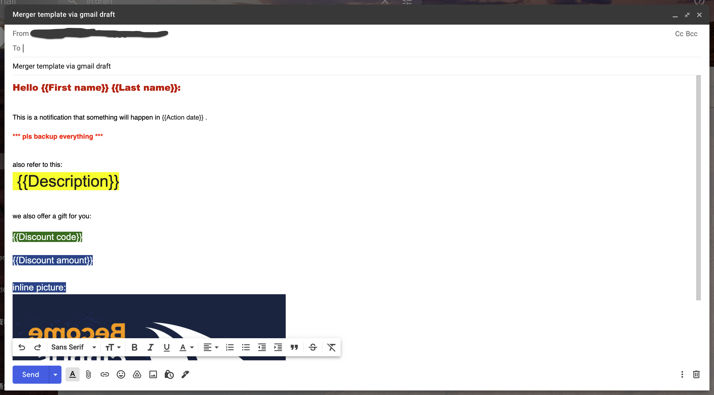

# gmail-draft-merger

A email merger tool by using the Gmail `draft` message as the template.


# Setup procedures

### 1. Create a GCP project (or reuse an existing one) from [Google Cloud Console](https://console.cloud.google.com)

### 2. Enabling API, `Gmail API` and `Google Sheet API`

Ref doc: https://cloud.google.com/endpoints/docs/openapi/enable-api#console

### 3. Setting up the OAuth consent screen with the necessary API scopes.

Ref doc: https://support.google.com/cloud/answer/6158849

<kbd>
  
</kbd>

<kbd>
  
</kbd>

<kbd>
  
</kbd>

<kbd>
  
</kbd>

<kbd>
  
</kbd>


### 4. Creating a OAuth Client ID with the `Desktop app` type.

Ref doc: https://support.google.com/cloud/answer/6158849

<kbd>
  
</kbd>

<kbd>
  
</kbd>

### 5. Download the client secret json file for later use.
<kbd>
  
</kbd>


### 6. Create a spreadshet as the user list with necessary `variables` that merger needs, ensure you then set the `SPREADSHEETS_ID` variable to its file ID.

Here is [one example Sheet](https://docs.google.com/spreadsheets/d/1lU3GChMP5DAh3MjeFuiLbkNc8PwO2OIYRIYcuE6racA/edit#gid=0) you can model yours with.

<kbd>
  
</kbd>

### 7. Create a draft message in your Gmail account as the template and fill in the corrsponding `variables` defined in above step. 

- Variables need to be quoted with double brackets, `{{` and `}}`
- Give a unique `subject` for later use

<kbd>
  
</kbd>


### 8. Install Python3 in your OS

[How to Install Python on Mac](https://www.freecodecamp.org/news/python-version-on-mac-update/)

[How to Install Python on Ubuntu](https://linuxhint.com/install-python-ubuntu-22-04/)


# Installation


### 1. Download the source and necessary python packages

```shell
git clone https://github.com/fangchih/gmail-draft-merger.git
cd gmail-draft-merger
python -m venv ./venv
source ./venv/bin/activate
pip install -r requirements.txt
```

### 2. Update the `.env` file, replace the value to yours

```
SPREADSHEETS_ID=YOUR_SPREADSHEET_ID
SHEET_NAME=YOUR_SHEET_NAME
GMAIL_DRAFT_SUBJECT=YOUR_GMAIL_DRAFT_SUBJECT
CLIENT_SECRET_FILE=YOUR_CLENT_SECRET_FILE
```

### 3. Clear the `Sent Time` column otherwise the merge will skip this row

<kbd>
  
</kbd>


### 4. Execute the main.py, merged mails will be sent, your can do few tests first to confirm the template is correct.

```shell
python src/main.py
```

You'll see the prompt as below and an opened browser page to guide you finish the OAuth Consent Screen process.

```shell
Please visit this URL to authorize this application: https://accounts.google.com/o/oauth2/auth?response_type=code&client_id=939289199400-5272mnc5o9ns5splr2fmr8k1n16kqkqk.apps.googleusercontent.com&redirect_uri=http%3A%2F%2Flocalhost%3A64486%2F&scope=https%3A%2F%2Fwww.googleapis.com%2Fauth%2Fspreadsheets+https%3A%2F%2Fwww.googleapis.com%2Fauth%2Fgmail.readonly+https%3A%2F%2Fwww.googleapis.com%2Fauth%2Fgmail.send&state=g0ZwnGwk489uO96edidZMomxuAfAwF&access_type=offline
/Volumes/Transcend/devfc/gmail-draft-merger/venv/lib/python3.11/site-packages/oauth2client/_helpers.py:255: UserWarning: Cannot access token.json: No such file or directory
  warnings.warn(_MISSING_FILE_MESSAGE.format(filename))

Your browser has been opened to visit:

    https://accounts.google.com/o/oauth2/auth?client_id=939289199400-5272mnc5o9ns5splr2fmr8k1n16kqkqk.apps.googleusercontent.com&redirect_uri=http%3A%2F%2Flocalhost%3A8080%2F&scope=https%3A%2F%2Fwww.googleapis.com%2Fauth%2Fspreadsheets+https%3A%2F%2Fwww.googleapis.com%2Fauth%2Fgmail.readonly+https%3A%2F%2Fwww.googleapis.com%2Fauth%2Fgmail.send&access_type=offline&response_type=code

If your browser is on a different machine then exit and re-run this
application with the command-line parameter

  --noauth_local_webserver
```

### 5. Follow these screenshots to finish the oauth consent process.

<kbd>
  
</kbd>

<kbd>
  
</kbd>

<kbd>
  
</kbd>

### 6. Once succeed, you will see the execution output in the terminal

```shell

Authentication successful.
0 {'Recipient': 'fangchih@xxxx.com', 'First name': 'Sherlock', 'Last name': 'Holmes', 'Action date': '2021/12/12', 'Description': 'Discount on Google Apps Script books', 'Discount code': 'AA001', 'Discount amount': '$23.00', 'Sent Time': '2023-08-31 08:19:49.469377'}
	 Passed...
1 {'Recipient': 'fangchih@xxxx.com', 'First name': 'Anthony', 'Last name': 'Lisa', 'Action date': '2021/12/23', 'Description': 'This is a wonderful world', 'Discount code': 'AA003', 'Discount amount': '$44.00', 'Sent Time': '2023-08-31 08:19:51.531738'}
	 Passed...
```

### 7. Cleanup and exit the python virtual env

```shell
deactivate
```

